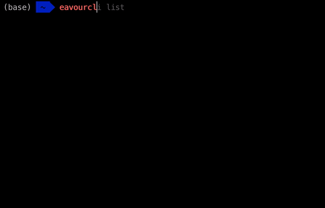
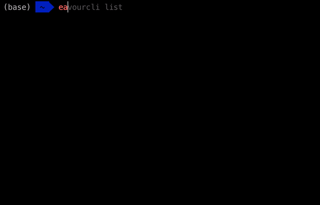
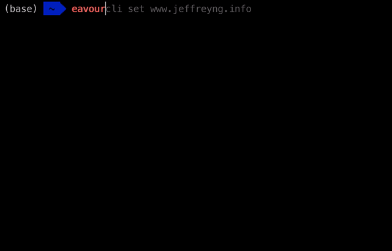

# dockerplus_cli

A CLI with a few commands that search through Docker images in a privately hosted Docker registry. The commands either do not work or are not free for privately hosted Docker registries. 

To search, users provide a query to the CLI, a `GET` request is made to the Docker registry API, and with fuzzy matching, relevant image names are displayed. Similarly, with list, a `GET` request is made to the Docker registry API and all image names are displayed. 

### Usage

Make sure you have go installed. Ensure your `$GOPATH` and `$GOROOT` are correctly configured. Also, make sure you are using a Unix based system, it doesn't work on Windows due to some path issues.

In your shell, run `go get github.com/Jeffrey-ch-Ng/dockerplus_cli/dockerplus` to install dockerplus.

Once you have installed dockerplus, run `dockerplus` to see the available commands. Also take a look at the descriptions below.

### list

To list all images, run `dockerplus list` to view all the Docker images that are currently on the image registry. 

### search

Search images in the image registry. Running `dockerplus search <query>` will return any matches between the image names and the query.
dockerplus uses fuzzy string matching to find the strings that match.

### set

Change the registry dockerplus is pointing to. This will allow the user to search for images on different image registries. 
Run `dockerplus set <new_docker_registry>` with the argument as the URL of the new Docker registry. 

## Image Registry

You can take a look at the setup for the image registry in the `setup.sh` file in the infrastructure folder. 
The `setup.sh` file outlines the commands to setup the Docker image registry as well as SSH. 
There is also additional setup that was not displayed, such as setting up the VM Instance and the domain name.